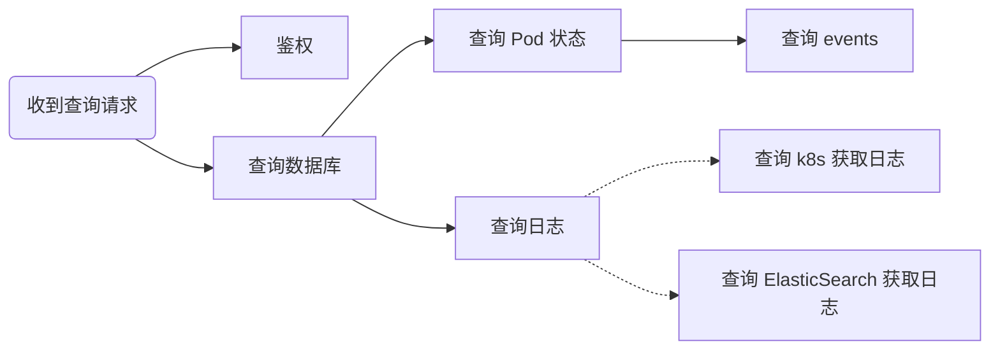

Package `context` 的引入是 Go 1.7 的重要特性。但好像在实践中，`context` 并没有太出现在我们的视野中；实际上，`kubernetes/client-go` [直到2020年](https://github.com/kubernetes/client-go/commit/1faf9e8d03b91c5c5529e1ac8ed6838fb6248049#diff-44c36ff04d213cbb389bfe45b53a1aae22bb37d2fb6ba7d1483ad9373724d725)才逐渐完善地将 package `context ` 融入其中。

之前在公司技术论坛有过一个问题“Go后台耗时优化方面有什么心得可以分享吗”，其中很多回答都有提到“并发”（实际上我们在项目实践中也是尽可能充分使用Go并发的能力），我们也发现package `context`也可以极大地方便我们进行并发过程的管理。现在结合GopherCon UK 2017的[talk](https://www.gophercon.co.uk/videos/2017/how-to-correctly-use-package-context/)中的技巧与我们实践中的经验，总结出了这篇文章 *The Context of the Package `context`*。

## 太长不看版

* `context.Context`可以被用于管理以一次请求为基础的过程，包括控制超时与完成、传递请求参数等。
* `WithValue(parent Context, key interface{}, val interface{}) Context` 用于增加请求相关的上下文内容，例如鉴权信息（注意，它并不被设计用来“传递函数参数”，详见后文）；key应该使用非导出类型的非导出全局变量；包应该提供封装好的类型安全的函数用于值的存取。
* `WithCancel(parent Context) (ctx Context, cancel CancelFunc)` 提供context的取消入口。
* `WithTimeout(parent Context, timeout time.Duration) (Context, CancelFunc)` 提供context的超时功能，类似的还有`WithDeadline(parent Context, deadline time.Time) (Context, CancelFunc)`。
* 获得的`cancel`函数应该被立即 `defer cancel()`，以便过程结束后该Context及时被回收，见[Cancelling in-progress operations](https://go.dev/doc/database/cancel-operations)。
* 通过上述函数创建的Context结构体自动构成从父节点到子节点的树状关系，一旦某个父节点超时/被取消，其所有后代节点自动超时/被取消。
* 监听是否超时/被取消，可使用结构体的`Done()`函数获取对应channel。
* 根节点（包括在main中或测试中）可使用`context.Backgroud()`来创建；如果暂不确定，可使用`context.TODO()`。

##### 启动并发任务并等待每个任务完成

逻辑比较简单，用`errgroup`即可；我们以两个并发任务为例：

```go
import (
      "context"
  
        "golang.org/x/sync/errgroup"
)
// Handler 并发调用 f1, f2 获取字符串并返回，如果其中一个错误则直接返回得到的错误
func Handler(ctx context.Context) ([]string, error) {
      eg, ctx := errgroup.WithContext(ctx)
      ret := make([]string, 2)
  
      eg.Go(func() error { // 新启动协程完成获取s1
          s1, err := f1(ctx)
          if err != nil {
            return err
          }
        ret[0] = s1
      })
  
      eg.Go(func() error { // 新启动协程完成获取s2
          s2, err := f2(ctx)
          if err != nil {
            return err
          }
        ret[1] = s2
      })
      // 等候两个协程完成，其中一个出现错误则立即返回，其他协程也会收到ctx.Done()的信号
      if err := eg.Wait(); err != nil {
            return nil, err
      }
      return ret
}
```

##### 启动并发任务等待最快返回的结果

```go
func do(ctx context.Context, i int) (string, error) {
    r1, r2 := rand.Intn(10000), rand.Intn(10000)
    time.Sleep(time.Duration(r1) * time.Millisecond) // pseudo-preprocess
    select {
    case <-ctx.Done(): // 如果preprocess结束发现已经被取消/超时，则直接退出
        return "", context.Canceled
    default: // 否则开始执行
        println("now we begin:", i)
    }
    time.Sleep(time.Duration(r2) * time.Millisecond) // pseudo-execute
    return strconv.Itoa(i), nil
}

func Vroom(ctx context.Context, goroutineNum int) string {
    // 为避免发送的线程阻塞造成goroutine泄漏，应使用 buffered channel
    ch := make(chan string, goroutineNum)
    ctx, cancel := context.WithCancel(ctx) // 创建 context 的 cancle 函数
    defer cancel() // return结果时就取消尚未执行的任务
    for i := 0; i < goroutineNum; i++ {
        go func(index int) {
            x, err := do(ctx, index)
            if err != nil {
                println(index, ":", err.Error())
                return
            }
            println("now we got:", x)
            ch <- x // 由于是buffered channel，因此即使没有接收方也不会阻塞
        }(i)
    }
    return <-ch
}

func main() {
    x := Vroom(context.Background(), 3)
    println("in main:"x)
    time.Sleep(10 * time.Second)
}
```

一次执行：

```go
now we begin: 0
now we begin: 1
now we got: 1
in main: 1
now we got: 0
2 : context canceled
```

（太长不看版结束）

------------------------

## Why Context?

### 应对请求时，服务应该具备的能力

当我们的服务在面对请求时，应该具备：

* 依赖模块/服务超时的检测的能力；
* 并发任务中，当正在进行的并发任务的结果不再被需要时（例如某一个任务返回了错误或超时），取消其他并发任务的能力；
* 控制一整个任务的超时情况。

例如，我们的服务在接收查询请求之后，需要进行鉴权、查询数据库里关联信息、查询对应Pod的状态、如果Pod故障查询相关事件、查询ElasticSearch或k8s以对应Pod的日志（取最快的那个）。我们希望该请求的处理能尽可能并发进行，于是过程对应下图的调用：



假设要求请求需要在3秒内返回，否则超时；很自然我们要求：

* 如果请求超时，所有正在进行的过程被取消；
* ES 或 k8s 获取到日志，另一个查询途径的请求取消；
* 如果任一环节失败，其他所有正在进行的并发任务应该被取消，直接以对应错误进行响应。

那么，我们的代码应该如何设计？

### Context的能力

使用`context.Context`，我们可以很方便地控制并发任务的超时与取消。

为满足上述条件，只需要在查询请求开始，调用`context.WithTimeout(3 * time.Second)`，并利用返回的Context进行后续的任务；并发任务一个错误即取消所有，参看上文的`errgroup`的使用；这里我们给出应对查询请求的函数以及获取Pod状态的函数：

```go
func getPodResult(ctx context.Context, podName string) (
  status, failureReason string, err error) {
    select {
    case err = <-ctx.Done(): // 如果已取消，则直接返回
        return "", "", err
    default:
    }
    podStatus := getPodStatus(ctx, podName)
    if isSuccessful(podStatus) {
        return podStatus, "", nil
    }
    select {
    case err = <-ctx.Done(): // 如果已取消，则直接返回
        return "", "", err
    default:
    }
    failureReason, err := getFailureReason(ctx, podName)
    return podStatus, failureReason, err
}

func Handle(ctx context.Context, req *GetInfoRequest) (*GetInfoResponse, error) {
    ctx, cancel := context.WithTimeout(ctx, 3*time.Second) // 请求总计3秒超时
    defer cancel()
    eg, ctx := errgroup.WithContext(ctx) // errgroup也会给ctx注册cancel函数
    eg.Go(
        func() error {
            ok, err := Auth(ctx, req)
            if err != nil {
                return err
            }
            if !ok {
                return NoPermissionError
            }
            return nil
        })
    var rsp *GetInfoResponse
    eg.Go(
        func() error {
            var err error
            rsp, err = query(ctx, req.TaskID) // query DB, pod and logs; use errgroup
            if err != nil {
                return err
            }
            return nil
        })
    if err := eg.Wait(); err != nil {
        return nil, err
    }
    return rsp, nil
}
```

## The Context of context.Context

### Context 结构体

Package `context`中的`Context`结构体长这样（把英文注释翻译为了中文，原文见[这里](https://pkg.go.dev/context#Context)），Go的注释也详细解释了Context应被怎样使用，尤其是关于其Value应该被怎样使用：

```go
type Context interface {
    // Deadline返回该context对应的超时取消时间。若未设置截止时间，则返回的ok==false。
    // 连续调用Deadline函数将返回同样的结果。
    Deadline() (deadline time.Time, ok bool)

    // Done 返回通过调用对应cancel函数来表示任务完成时即被关闭的channel。如果context无法被取消，则Done返回nil. 连续调用Done函数将返回同样的结果。
    // Done channel可能会在cancel被调用之后异步地被关闭。
    //
    // WithCancel 使得当cancel被调用时，Done channel被关闭；
    // WithDeadline 使得当截止时间超过时，Done channel被关闭；
  // WithTimeout 使得当超时时，Done channel被关闭。
    //
    // Done可被用于select语句:
    //
    //  // Stream 通过调用DoSomething产生输出并发送至out，直至
    //  // DoSomething返回错误或ctx.Done被关闭。
    //  func Stream(ctx context.Context, out chan<- Value) error {
    //      for {
    //          v, err := DoSomething(ctx)
    //          if err != nil {
    //              return err
    //          }
    //          select {
    //          case <-ctx.Done():
    //              return ctx.Err()
    //          case out <- v:
    //          }
    //      }
    //  }
    //
    // 更多使用Done channel进行任务取消的例子见：
    // https://blog.golang.org/pipelines
    Done() <-chan struct{}

    // 如果Done尚未被关闭, Err将返回nil。
    // 如果Done尚已被关闭, Err将返回非nil错误，其说明了关闭原因：
    // Canceled 当context被cancel，或者
    // DeadlineExceeded 当超过截止时间。
    // 当Err返回非nil error后, 连续调用Err函数将返回同样的结果。
    Err() error

    // Value 返回本context中对应key的值，如果没有该key对应的值则返回nil。
    // 使用同样的key来连续调用Value函数将返回同样的结果。
    //
    // 仅对请求基础上的、在不同过程或API范围内的数据使用context，
    // 而不要将此作为传递函数可选参数的方式。
    //
    // 一个key用于确定Context中的一个特定的值。
  // 希望在Context中存储值的函数通常使用全局变量来作为context.WithValue和Context.Value的参数。
  // key可以是任意支持相等比较的类型；包应该定义key为非导出类型以避免碰撞。
    //
    // 定义Context key的包需要为相应的值提供类型安全的访问入口：
    //
    //     // Package user定义了存储于Context中的User类型。
    //     package user
    //
    //     import "context"
    //
    //     // User 是存储于Context中的类型。
    //     type User struct {...}
    //
    //     // key是本package中非导出的类型。
    //     // 其避免了与其他包中定义的key类型产生冲突。
    //     type key int
    //
    //     // userKey为存储在Context中的user.User值的对应的key。
    //     // 它是非导出的；使用方应使用user.NewContext和user.FromContext函数，而不是
    //     // 直接使用本key。
    //     var userKey key
    //
    //     // NewContext 返回保存了u的Context。
    //     func NewContext(ctx context.Context, u *User) context.Context {
    //         return context.WithValue(ctx, userKey, u)
    //     }
    //
    //     // FromContext 返回ctx中保存的User类型值。
    //     func FromContext(ctx context.Context) (*User, bool) {
    //         u, ok := ctx.Value(userKey).(*User)
    //         return u, ok
    //     }
    Value(key interface{}) interface{}
}
```

### Context.Value的注意事项

* Value仅用于存储和Context生命周期相关的数据，而不是用来传递可选参数的；

    * 由此，Value里的值应该是设置后不应更改的；

* Value的key应该使用包内非导出的类型定义的非导出的全局变量，值的存取应该使用包提供的类型安全的函数而不是直接操纵`Context.Value`；

* Value中存在的值作为必不可少的参数时，为了高可读性，也不应该通过Context去获取，例如下方函数，即使`uin`和本次请求强绑定并存到了Context中，也应该显式地作为函数参数，例如`func IsAdmin(ctx context.Context, uin string) (bool, error)`。

    > `Context.Value` should inform, not control. 
    >
    > –Jack Lindamood

### 树状Contexts

新创建的Context总是原有Context的子节点，并受原有Context的Deadline、cancel、Value影响。例如：

```go
func testWithTimeout() {
    a1 := context.Background()
    b2, cancelB2 := context.WithTimeout(a1, time.Minute)
    defer cancelB2()
    c3, cancelC3 := context.WithTimeout(b2, time.Hour)
    defer cancelC3()
    d3, cancelD3 := context.WithTimeout(b2, time.Second)
    defer cancelD3()
    e2, cancelE2 := context.WithCancel(a1)
    defer cancelE2()
    fmt.Println(a1.Deadline())
    fmt.Println(b2.Deadline())
    fmt.Println(c3.Deadline())
    fmt.Println(d3.Deadline())
    cancelB2()
    if err := d3.Err(); err != nil {
        fmt.Println("d3 is canceled:", err)
    }
    if err := e2.Err(); err == nil {
        fmt.Println("e2 is not canceled yet")
    }
}
/*
0001-01-01 00:00:00 false
2021-11-29 20:29:44.839665 m=+60.001770296 true
2021-11-29 20:29:44.839665 m=+60.001770296 true // 受父节点的1分钟超时影响，新设置1小时超时无效
2021-11-29 20:28:45.839691 m=+1.001796617 true  // 新设置的1秒后超时
d3 is canceled: context canceled                // 因为父节点被cancel
e2 is not canceled yet                          // 不受非祖先节点的其他节点影响
*/
```

## 其他注意事项、总结

去看“太长不看版”。关于context源码的解读可见下一篇文章。
