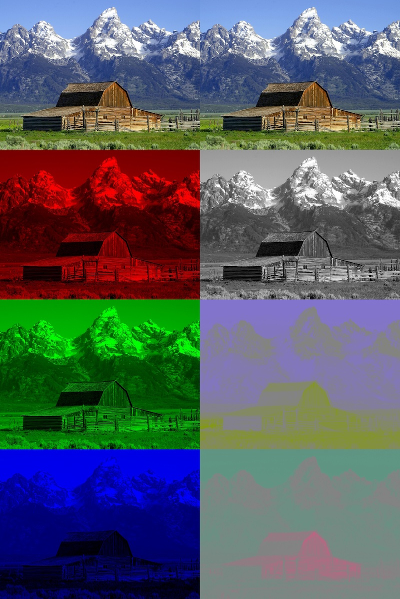
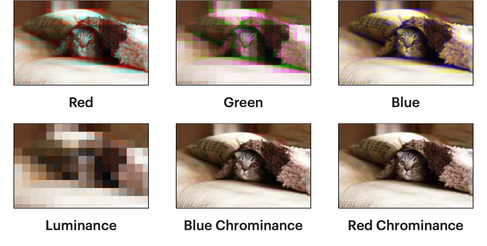
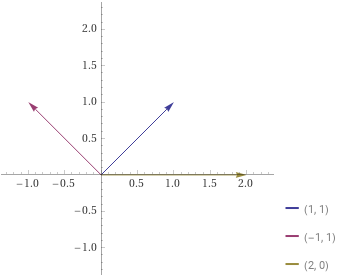
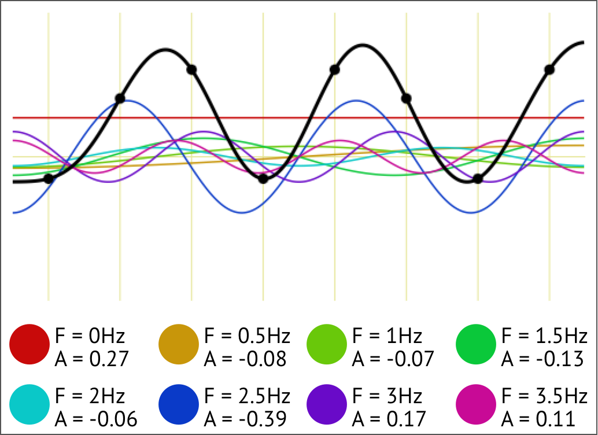
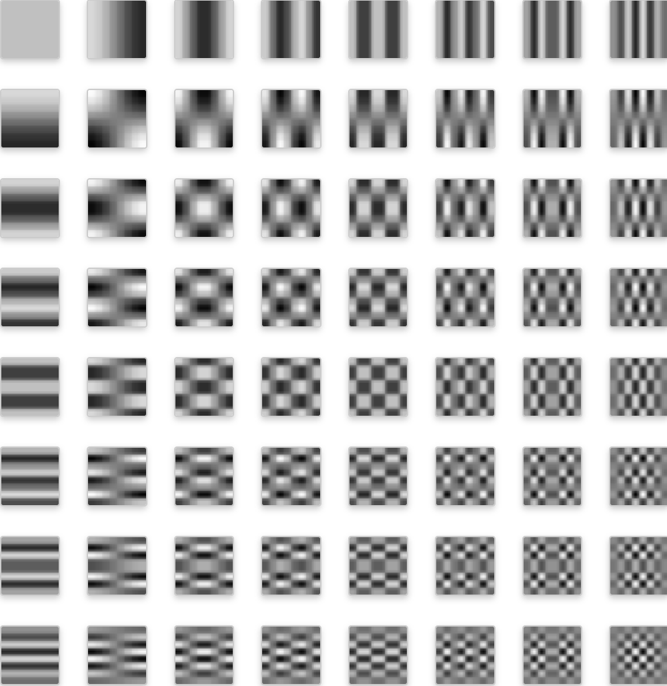
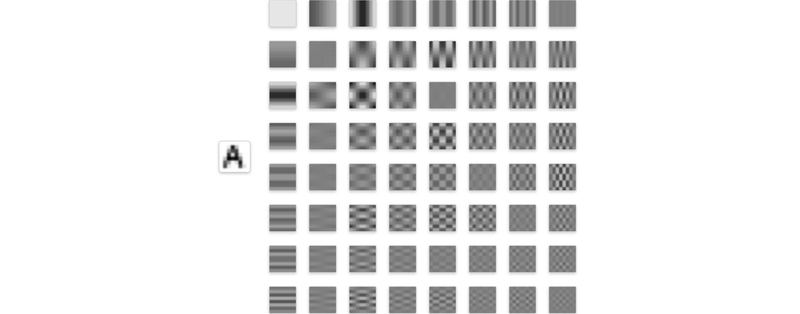
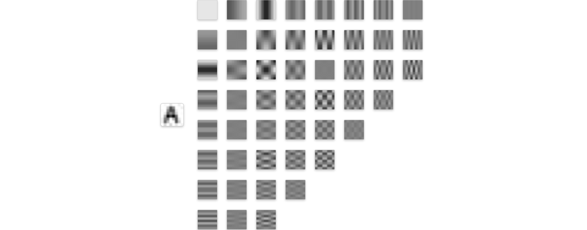

NVIDIA在2018年6月发布了基于GPU加速的用于解码JPEG的nvJPEG。实际上早在1998年，libjpeg/SIMD就开始使用SIMD指令集对JPEG编解码进行加速。我们可能会问：为什么JPEG编解码过程可以被SIMD或GPU加速？为什么我们又尚未看见类似的对PNG进行加速的项目？本文将从JPEG编解码原理出发，简单讲解SIMD加速的原理，并简要说明PNG不能被加速的原因。
<!--more-->

NVIDIA在2018年6月发布了基于GPU加速的用于解码JPEG的nvJPEG，而实际上早在1998年，libjpeg/SIMD就开始使用SIMD指令集对JPEG编解码进行加速。为什么JPEG编解码过程可以被SIMD或GPU加速？为什么我们又尚未看见类似的对PNG进行加速的项目？本文将从JPEG编解码原理出发，简单讲解SIMD加速的原理，并简要说明PNG不能被加速的原因。

# JPEG

## 像素、色彩空间与降采样

### 像素

图片由多行多列的像素构成。RGB显色模型根据人眼识别颜色的原理，所有显色都被展示为三个分量，R-红色、G-绿色和B-蓝色；因此，知道了每个像素的三原色的值，就可以还原出该像素的颜色，从而逐一表示整幅图像。


### 色彩空间转换

每个像素可以被表示为RGB三个分量，也可以被表示为YCbCr（或，YUV）三个分量：

* Y表示亮度（RGB三色共同决定了亮度）；
* Cb/U表示蓝色投影，表示蓝色部分与亮度值之间的差异；
* Cr/V表示红色投影，表示红色部分与亮度值之间的差异。



#### 为什么需要转换至YUV色彩空间？

YUV诞生于黑白电视向彩色电视过渡的时期，设计如此是因为YUV的Y-亮度分量可以直接被黑白电视显示，因此彩色电视信号得以兼容黑白电视[1]；并且由于早期电视信号带宽有限，可以通过**降采样YUV信号的色度分量**（YUV422：每两个像素共用一个色度信号；YUV420：每4个像素共用一个色度信号）来节省带宽。


#### 为什么对色度的降采样是有效的？

人类每只眼球视网膜含有600~700万视锥细胞来感知颜色[2]，而含有约1亿个视杆细胞来感知亮度[3]；下列是降采样比例较高时的对比图[4]：



这里，可以看出同样比例的降采样幅度，色度的降采样对图像画质影响最小、亮度最大。

因此，JPEG编码时通常会对色度进行YUV420的降采样——原来一个像素的RGB三个分量各需要8 bits进行编码（每个像素24 bits），现在4个像素的YUV分量需要32 bits、8 bits、8 bits进行编码（每个像素12 bits）。

在下文中，我们只对某一个分量的某一部分进行分析。

## 数学魔法：离散余弦变换与量化

例如，我们把图片分割成$8 \times 8$像素大小的块，对每块进行处理（直观是，相邻的像素比较相像，值偏差不大）。

### 离散余弦变换

#### 从线性空间说起

我们以一维的数值进行讨论，稍后我们可以推广至二维。我们考虑$[-1, 1]^8$（或$\{i\in Z | -128 \leq i < 127\}^8$，8个int8数值）的线性空间，直观地说，就是8个$[-1, 1]$数字组成的有序对，例如$(0, 1, 0, -1, 0.5, 0.5, 0.5, 0.5)$；你可以理解为一个8维空间内的坐标点，只不过每个坐标轴上的投影距离原点不超过$1$。现在有一组在该线性空间基底，很明显，这样的有序对可以被该组基底线性表示。离散余弦变换就定义了这样一组基底。

##### 示例

二维平面有一个向量$p = (1, 1)$；现在给定两个向量$x = (1, 0), y = (1, -1)$，我们可以计算：

$$p = ax + by$$，即

$$1 = a + b$$

$$1 = -b$$

可以得到

$$a = 2, b = -1.$$



从线性空间的角度来讲，我们已经讲完了离散余弦变换。就是8个点被8个组成基底的向量表示，只不过每个基底可以被一个余弦函数表示罢了。

#### 一维离散余弦变换：可视化



#### 二维离散余弦变换：可视化

$8\times8$的基底[5]：



其中，最后一个余弦函数大概长这样[6]：


我们可以把图像A表示为64个由余弦函数表示的图像之和[5]：



#### 为什么需要离散余弦变换

我们只是从一个基底的表示（“直角坐标系”的）得到了另一个基底的表示，但表示一个向量所需的系数数量并没有减少，仍然是64个系数（甚至类型从int8扩大到了int16）；那么我们为什么要花费算力进行离散余弦变换？

直观地讲，对于一张像素间变化比较连续的图像，这64个基底的「高频」部分分量会比较少（靠右下的基底颜色接近灰色）；还是上方的图像，假设我们直接拿掉最后18个系数，可以看见图片也具有辨识度[6]。



### 量化

到目前为止，我们的Y分量仅仅做了无损的变换（也许因为系数以小数表示的问题略微丢失了一点信息），还没有节省任何空间。为了实现节省空间，我们需要使得系数能够被方便地压缩。

量化可以实现这一点；我们对每一个8x8方格的8x8个系数，按位置分别除以一个常数（然后取最近的整数），我们就成功地把每个系数的精度降低了。比如：

DCT后原8x8系数矩阵是这样的：


假设量化矩阵长这样：


得到了下方的结果：


于是我们得到了大量的0；而剩下的非零数字都比较小，可以更好地被编码了。

## 压缩

JPEG编码的压缩部分有以下几点值得一提：

1. 每个8x8量化后系数的第$(0, 0)$位，在Y分量代表该区块的平均亮度，被汇总起来使用游程编码（delta encoding）。例如，假设每个区块的平均亮度量化后的值为$12, 13, 14, 14, 14, 13, 13, 14$，我们计算每个值与前值的差值，得到$12, 1, 1, 0, 0, -1, 0, 1$。
2. 所有系数被zig-zag型编码，因为剩下这63个位于基底的向量两两正交，而zig-zag线上两两仅相差一个方向上的分量，因此相似的两个频率的系数被排到了一起。
   
3. 各系数，每个非0值被$\geq 2$个字节表示，第一个字节前4位表示前面有多少个0、后4位表示该值占多少位，后一个字节表示该非零值。
4. 对所有字节进行霍夫曼编码。

## 小结

假设输入是RGB表示的图像，我们进行JPEG编码，依次需要：

##### 色彩空间转换：RGB to YCbCr

##### 色度降采样

##### 以8x8像素为单位分割图像

假设我们的图像的Y分量是：


##### 离散余弦变换

每个值先自减128，然后进行8x8的DCT：


##### 量化

根据JPEG Standard给出的对应质量的量化矩阵：


进行每个值的量化：


例如，$\textrm{round} \left( \frac {-415.37}{-26} \right) \to -26$

##### 编码

首先进行zig-zag编码，变成：

```
−26 −3 0 −3 −2 −6 2 −4 1 −3 1 1 5 1 2 −1 1 −1 2 0 0 0 0 0 −1 −1 0 0 0 0 0 0 0 0 0 0 0 0 0 0 0 0 0 0 0 0 0 0 0 0 0 0 0 0 0 0 0 0 0 0 0 0 0 0
```

对DC系数（$B_{0, 0}$）进行与上一个8x8像素块的DC系数进行游程编码，然后对每个系数进行游程编码：

```
(X, Y)(Z);(0, 2)(-3);(1, 2)(-3);(0, 1)(-2);(0, 2)(-6);(0, 1)(2);(0, 1)(-4);(0, 1)(1);(0, 2)(-3);(0, 1)(1);(0, 1)(1);(0, 2)(5);(0, 1)(1);(0, 1)(2);(0, 1)(-1);(0, 1)(1);(0, 1)(-1);(0, 1)(2);(5, 1)(-1);(0, 1)(-1);(0, 0);
```

然后对所有byte进行霍夫曼编码。

# JPEG快速编解码

这里我们介绍JPEG的快速编解码，我们以编码为例。`libjpeg-turbo`使用SIMD实现了JPEG编解码，加速比可以到2至6。

### SIMD

SIMD（single instruction, multiple data），单指令流多数据流，使得CPU可以利用超过32位的寄存器进行单一指令下对多条数据进行操作。Intel在1997年推出了使用64位浮点寄存器的MMX指令，在1999年奔腾III系列处理器上推出了使用128位寄存器的SSE指令，后续在奔腾IV系列处理器上推出的SSE2指令集使得128位XMM寄存器支持被拆分为多个整数，后续AVX、AVX-512指令分别支持了256位、512位的寄存器。

#### 例子

SSE2中的`_mm_avg_epu8`，一次可以计算2组16个8位整数的平均数：

|      R0       |      R1       | ...  |       R15       |
| :-----------: | :-----------: | :--: | :-------------: |
| (a0 + b0) / 2 | (a1 + b1) / 2 | ...  | (a15 + b15) / 2 |

`_mm_add_epi16`指令，一次可以将2个XMM寄存器存储的各8个16位整数进行相加：

|   R0    |   R1    | ...  |   R7    |
| :-----: | :-----: | :--: | :-----: |
| a0 + b0 | a1 + b1 | ...  | a7 + b7 |

而`_mm_madd_epi16`指令，可以完成下方的操作，得到4个32位整数：

|          R0           |          R1           |          R2           |          R3           |
| :-------------------: | :-------------------: | :-------------------: | :-------------------: |
| (a0 * b0) + (a1 * b1) | (a2 * b2) + (a3 * b3) | (a4 * b4) + (a5 * b5) | (a6 * b6) + (a7 * b7) |

### 加速JPEG编码

JPEG编码包含的步骤

1. RGB-YCbCr 颜色空间转换；
2. 色度降采样；
3. 分块；
4. 值自减128（uint -> int）与DCT；
5. 量化；
6. 调整zig-zag顺序与霍夫曼编码。

以上各步骤均已被SSE2实现，大部分步骤已有AVX2实现。因为在JPEG编码过程中，数据基本都是`uint8`、`int8`与`int16`，因此每一条指令可操作的数据量是较大的；而SIMD的使用也非常直观：

1. 颜色空间的转换，每个分量可以表示为$X = iR + jG + kB + l.$ 这完全适合用上方提到的`_mm_madd_epi16`指令。
2. 降采样，可以充分利用`_mm_avg_epu8`指令，计算像素色度的均值；
2. 分块，即更换各值位置；
2. 值自减128类似，利用`_mm_subs_epi8`即可，而DCT本质上是一个矩阵运算（基底按列组成矩阵的逆矩阵，该矩阵是确定的），因此DCT可以被加速为一个$8 \times 8$的矩阵与一个$8$维列向量的乘法；
2. 量化，即向量除法；
2. 调整zig-zag顺序也可以[使用向量算数运算完成](https://github.com/libjpeg-turbo/libjpeg-turbo/blob/main/simd/x86_64/jchuff-sse2.asm)。

## 为什么PNG不行？

其实，PNG可以使用SIMD进行优化，但只能优化一部分步骤。

PNG的压缩分两个步骤：

1. 逐分量逐行使用滤波器（PNG标准包含5种），使得每byte更容易压缩（使用左侧byte、上方byte对该byte值进行预测，然后减去实际值）：

   ```
   predict by left: [12, 13, 14, 15] -> [12, 1, 1, 1]
   ```

2. 对所有byte使用LZ77+霍夫曼编码进行压缩，例如使用`zlib`。

第一步使得像素依赖左侧、上方的像素，因此无法并行编解码（无论是SIMD或是GPU）；第二步可以使用通用的[SIMD](https://github.com/cloudflare/zlib)或[GPU](https://hgpu.org/?p=18542)实现。

## 参考文献

[1] https://en.wikipedia.org/wiki/Georges_Valensi

[2] https://en.wikipedia.org/wiki/Cone_cell

[3] https://en.wikipedia.org/wiki/Rod_cell

[4] https://parametric.press/issue-01/unraveling-the-jpeg/

[5] https://www.jezzamon.com/fourier/index.html

[6] https://alexdowad.github.io/visualizing-the-idct/