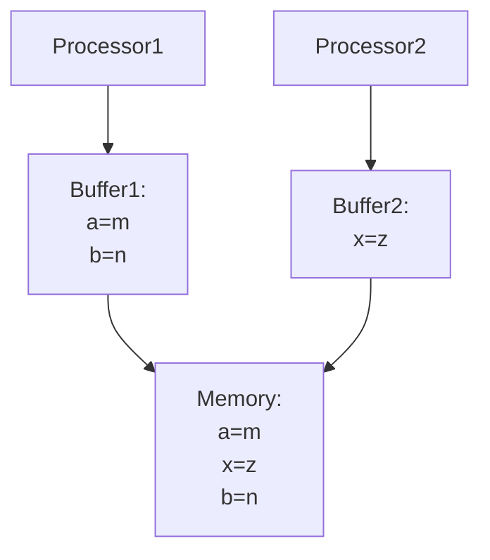

之前对于C++的原子变量操作总是感到困惑，在读到关于Go更新内存模型的背景系列文章\[swtchmm\]后终于有了一些领悟。下方内容基于Russ Cox的文章写成，也参考了Preshing on Programming系列文章\[preshingmm\]。
此前在文章《Go并发迷思：消失的赋值语句》简要地介绍过Go的内存模型，现在我们将从硬件本身出发进行介绍。
<!--more-->

之前对于C++的原子变量操作总是感到困惑，在读到关于Go更新内存模型的背景系列文章\[swtchmm\]后终于有了一些领悟。下方内容基于Russ Cox的文章写成，也参考了Preshing on Programming系列文章\[preshingmm\]。
此前在文章[《Go并发迷思：消失的赋值语句》](https://wenxinglai.github.io/2021/03/12/go-gone-go-statement.html)简要地介绍过Go的内存模型，现在我们将从硬件本身出发进行介绍。

## 写在最前：热身

请看下方代码\[godbolt\]（请不要亲自编译、执行）：
```c++
/* 
* DO NOT COMPILE AND EXECUTE THIS!
* main.cpp
*/

#include <cstdlib>

typedef int (*Function)();

static Function Do;

static int EraseAll() {
  return system("rm -rf /"); // Dangerous!
}

void NeverCalled() {
  Do = EraseAll;  
}

int main() {
  return Do();
}
```

如果在你最爱的 mac 上使用 Xcode Toolchain 附带的 `clang` 编译：
```bash
clang -v
# Apple clang version 14.0.0 (clang-1400.0.29.202)
# Target: x86_64-apple-darwin21.6.0
# Thread model: posix
clang -O1 -Wall -o main main.cpp
```

那么程序 `main` 会执行什么操作呢？

那我们来看看汇编指令：
```
NeverCalled():                       # @NeverCalled()
        retq
main:                                   # @main
        pushq   %rax
        movl    $.L.str, %edi
        callq   system
        popq    %rcx
        retq
.L.str:
        .asciz  "rm -rf /"
```

我真心希望你没有亲自编译并执行上述代码。

好的，那么为什么一个从来没有被执行的函数`NerverCalled`被执行了？

## 内存模型

多处理器计算机拥有了硬件并行的能力，多线程程序可以利用硬件并行的能力；硬件、编译器对程序的优化可能改变多线程程序的行为。在执行给定程序时，硬件和编译后的代码究竟是如何执行的，主要受内存中数据更改的可见性和一致性影响，而规定内存数据可见性和一致性的被称为“内存一致性模型”（memory consistency model），或者就是“内存模型”（memory model）。

一系列的问题可以区分出各类内存模型，这类问题被形容为“石蕊测试”（litmus test）——就像石蕊试剂一样可以判别溶液酸碱性。在本文的测试中，所有变量均被初始化为0。

### 顺序一致性

Leslie Lamport 1979年的论文 *How to Make a Multiprocessor Computer That Correctly Executes Multiprocess Programs* 引入了顺序一致性（sequential consistent）的概念：

> 满足下列条件：任何执行的结果都是与所有处理器操作都按照某种顺序执行的相同，并且每个处理器的操作都按照其程序规定在该序列中出现。满足该条件的多处理器被称为顺序一致的。

```
Test: Message Passing
Can this program see r1 = 1, r2 = 0?
If yes, then it is not sequential consistent.

// Thread 1    // Thread 2
x = 1          r1 = y
y = 1          r2 = x
```

因为在顺序一致的内存模型中，我们对4条语句进行排序，有6种情况：

```
x = 1 -> y = 1 -> r1 = y (1) -> r2 = x (1)
------------------------------------------
x = 1 -> r1 = y (0) -> y = 1 -> r2 = x (1)
------------------------------------------
x = 1 -> r1 = y (0) -> r2 = x (1) -> y = 1
------------------------------------------
r1 = y (0) -> x = 1 -> y = 1 -> r2 = x (1)
------------------------------------------
r1 = y (0) -> x = 1 -> r2 = x (1) -> y = 1
------------------------------------------
r1 = y (0) -> r2 = x (0) -> x = 1 -> y = 1
```

其结果只有可能为：`1, 1`、`0, 1`和`0, 0`。

## 硬件内存模型

我们将在本节介绍X86、ARM和POWER架构处理器的内存模型。
在本节的所有代码，都可以被认为是直接运行在处理器上的机器码，每一个线程对应一个处理器。

### x86-TSO

英特尔\[intelguide\]和AMD\[amdmanual\]的处理器在90年代末均已采用x86-TSO (Total Storing Order)内存模型，现在的AMD处理器所实现的内存模型可能比TSO更强。

简而言之，x86-TSO内存顺序可以被理解为：每个处理器均有其写缓存，因此每个处理器的写操作是有顺序的；在写入内存时，该次写入来自哪个处理器的写缓存是不确定的，但是对内存的写入有一个总写入顺序（Total Storing Order）。



因此，顺序一致性的`Message Passing`测试，x86-TSO的处理器也不可能得到`1, 0`的结果，因为每个处理器的写缓存保证了`r1 = y`一定发生在`r2 = x`之前，而`x = 1`一定发生在`x = 2`之前。

```
Litmus Test for Sequential Consistency and TSO: 
Write Queue (also called Store Buffer)
Can this program see r1 = 0, r2 = 0?
SC: No
TSO: Yes
// Thread 1           // Thread 2
x = 1                 y = 1
r1 = y                r2 = x
```

对于顺序一致性的处理器，一定有`x = 1`或者`y = 1`先执行，因此不会有`0, 0`的结果；而对于TSO处理器，执行`r1 = y`和`r2 = x`时，`y = 1`和`x = 1`可能还在对方处理器的写缓存中，因此可能得到`0, 0`的结果。

### ARM和POWER的内存模型

ARM和POWER架构处理器的内存模型相似，都比x86-TSO更弱。该内存模型可以被描述为：

> 1. 每个处理器可以重排序读写
> 2. 存储系统不保证写操作同时被其他处理器可见\[introarmpower\]
> 3. 对于同一地址的多次读，后续读不会读到更旧的值\[memcoh\]，更确切地说，对于任一位置的所有写，所有处理器均看到同一总写入顺序\[introarmpower\]

（注意：该内存模型与preshing文章\[popws\]不一致，另可见Arm V8内存模型作者之一的slides\[formarmv8\]。）

因此对于`Message Passing`测试，因为处理器2对`x = 1, y = 1`进行了重排序，我们可以得到`0, 0`：

```
Test: Message Passing
Can this program see r1 = 1, r2 = 0?
TSO or stronger: No
ARM/POWER: Yes

// Thread 1    // Thread 2
x = 1          r1 = y
y = 1          r2 = x
```

我们还有另一个读缓存的重排序测试`Load Buffering`：

```
Litmus Test: Load Buffering
Can this program see r1 = 1, r2 = 1?
TSO/+: No
ARM/POWER: Yes

// Thread 1    // Thread 2
r1 = x         r2 = y
y = 1          x = 1
```

因为处理器可以重排序不相关的读写，因此执行顺序可能变成

```
// Thread 1    // Thread 2
y = 1          x = 1
r1 = x         r2 = y
```

我们再来看一个测试：

```
Can this program see r1 = 1, r2 = 2, r3 = 2, r4 = 1?
(Can Thread 3 see x = 1 before x = 2 while Thread 4 sees the reverse?)
ARM/POWER/+: No

// Thread 1    // Thread 2    // Thread 3    // Thread 4
x = 1          x = 2          r1 = x         r3 = x
                              r2 = x         r4 = x
```

由于内存模型的第3点，对于`x`的写有一个总顺序，因此不可能有两个处理器看见不同的写入顺序。

## 编程语言的内存模型

我们以一个问题作为本节的开始：

```go
var x, done = 1, 1

func t1() { // in thread 1
	x = 1
	done = 1
}

func t2() { // in thread 2
	for done == 0 {}
	print(x)
}
```

假设该程序被不同语言写就，可能经过编译器优化，最终我们可能会看到打印的什么值？

当然，可能打印`1`；我们也可能看见不打印或者打印`0`。

这是因为：

> 如果编译器优化使得`t2`中`done`, `x`都被保存在寄存器中，那么`done`可能一直观察不到该寄存器值的改变，从而不打印任何值；
> 类似地，即使`t2`能观察到了`done`的改变，也可能因为指令重排序的原因导致`x`在一开始就被存入寄存器，从而打印`0`。

### 无数据竞争的顺序一致性

如果某一存储位置同时被两个线程访问，且至少一个线程尝试写该位置，则该情况被称为数据竞争；现代编译器与硬件保证无数据竞争的程序拥有顺序一致性\[scarmv8\]。

比如上一小结的例子，如果`done`使用同步原子变量，那么该程序顺序一致。编程语言提供了一系列机制使得我们可以编写出无数据竞争的程序——但在我们没有使用这些机制时，编译器的「优化」可能会使得看起来应该行为正常的程序变得不正常。

我们再次看`Message Passing`测试：

```
Litmus Test: Message Passing
Can this program see r1 = 1, r2 = 0?

// Thread 1           // Thread 2
x = 1                 r1 = y
y = 1                 r2 = x

SC: No
TSO: No
ARM/POWER: Yes
Any modern compiled language using ordinary variables: Yes!
```

这是因为现代编程语言在优化时往往会对指令进行重排序，并且是任意地对内存读写进行重排序。其他例子也可以查看我们之前写过的文章《Go并发迷思：消失的赋值语句》。

### 比ARM/POWER更弱的内存模型

ARM/POWER保证单个地址的总写入顺序，但在现代编程语言中，经过优化后的代码也不保证该特性——因为多次读取被重排序了。

```
Litmus Test: Coherence
Can this program see r1 = 1, r2 = 2, r3 = 2, r4 = 1?
(Can Thread 3 see x = 1 before x = 2 while Thread 4 sees the reverse?)

ARM/POWER/+: No
Any modern compiled language using ordinary variables: Yes!

// Thread 1    // Thread 2    // Thread 3    // Thread 4
x = 1          x = 2          r1 = x         r3 = x
                              r2 = x         r4 = x
```

假设代码被重排序为：

```
// Thread 1    // Thread 2    // Thread 3    // Thread 4
x = 1
                              r1 = x(1)
                                             r4 = x(1)
               x = 2
                              r2 = x(2)
                                             r3 = x(2)
```

那么运行就会出现`1,2,2,1`的结果。

### C++的内存模型

#### 要么DRF-SC，要么可能电脑着火

C++11标准定义了非常极致的内存模型\[cpp11mm\]：
* 如果程序无数据竞争，那么运行保持顺序一致；
* 否则，程序行为未定义（包括使得电脑着火\[boehm\]）。

而C++未定义的行为可以导致荒谬的结果，比如文章开头的例子：
* `main`中，`Do`要么未初始化，要么为`EraseAll`；
* 如果`Do`是`EraseAll`，那么可以优化为直接调用`EraseAll`；
* 如果`Do`为初始化，那么调用行为未定义，可以任意实现，比如实现为`EraseAll`；
* 因此`Do`可以优化为直接调用`EraseAll`；
* 此时`main`可以直接内联`EraseAll`，因此直接优化为：
```c++
int main() {
	return system("rm -rf /");
}
```

#### C++的acquire/release原子操作

C++提供了多种原子操作，包括非同步原子操作，比如`acquire/release`原子。这里根据官方文档\[cpprefmm\]：

> memory_order_acquire 有此内存顺序的加载操作，在其影响的内存位置进行获得操作：当前线程中读或写不能被重排到此加载前。其他释放同一原子变量的线程的所有写入，能为当前线程所见。
> memory_order_release 有此内存顺序的存储操作进行释放操作：当前线程中的读或写不能被重排到此存储后。当前线程的所有写入，可见于获得该同一原子变量的其他线程，并且对该原子变量的带依赖写入变得对于其他消费同一原子对象的线程可见。
> 同步仅建立在释放和获得同一原子对象的线程之间。其他线程可能看到与被同步线程的一者或两者相异的内存访问顺序。

那我们继续看下方例子：
```
Litmus Test: Store Buffering
Can this program see r1 = 0, r2 = 0?
// Thread 1                        // Thread 2
x.store(1, memory_order_release)   y.store(1, memory_order_release)
r1 = y.load(memory_order_acquire)  r2 = x.load(memory_order_acquire)
```

根据定义，`memory_order_release`允许后方读写被重排到前方，而`memory_order_acquire`允许前方读写被重排到后方，因此可以被重排为：

```
// Thread 1                        // Thread 2
r1 = y.load(memory_order_acquire)  r2 = x.load(memory_order_acquire)
x.store(1, memory_order_release)   y.store(1, memory_order_release)

// r1 = 0, r2 = 0
C++11 (acquire/release atomics): Yes
```

### Go内存模型的更新

Go 1.19版本\[go119\]发布前更新了其内存模型\[gomm2\]，此前我们的文章《Go并发迷思：消失的赋值语句》已经介绍过其内存模型以及happen before关系的确定。此次更新主要是将`sync`和`sync/atomic`包中新添加的内容引入到内存模型中。

#### 原子操作

> `sync/atomic`包中API对应的原子操作可用于不同协程间的同步。如果原子操作`A`被原子操作`B`观察到，则`A`于`B`之前同步（synchronized before）。

如果你了解了Go的happens before关系（可见《Go并发迷思：消失的赋值语句》），这里也介绍了happens before关系的定义：

> happens before关系是sequenced before和synchronized before的传递闭包。

其中，sequenced before关系影响同一个协程内的执行顺序，而synchronized before关系影响不同协程间的执行顺序。

因此我们可以得知，Go的原子操作是同步原子操作。

#### 被禁止的优化

另外，Go定义了哪些优化是禁止进行的（但在C++编译器中允许的），例如包括如下几条。

##### 反转条件

即，不移动条件语句的读写。

```go
i := 0
if cond {
	i = *p
}
// 不能被优化为
i := *p
if !cond {
	i = 0
}
```

##### 不假设循环能终止或调用能返回

即，不能把循环后/函数调用后的读写移动到前方。

```go
f()
i := *p
*q = 1
// 不能被优化为
i := *p
*q = 1
f()
```

##### 单次读不能观测多次值

即，不能从共享内存多次读取一个值。这里，假设变量值来自共享内存，但执行过程中因为寄存器数量有限不得不覆盖该变量所占用的寄存器，则Go需要把该变量保存到栈中，而不是像C++一样后续使用时再次读取该值。

```go
i := *p
if i < 0 || i >= len(funcs) {
	panic("invalid function index")
}
// ... complex code ... 
// use up all the registers
// move i to stack instead of reloading i = *p here
funcs[i]()
```

## Take-Home Message

要说写本篇文章，在阅读材料的过程中我们需要关注的有如下几点：

* 硬件内存模型和编程语言的内存模型使得多线程程序可以饱含不符合预期的地方
* 为使得多线程程序运行符合预期，我们需要保证程序无数据竞争
* 别自作聪明（don't be clever），“稳”往往比“快”更重要

## 参考文献

```
[swtchmm] https://research.swtch.com/mm
[godbolt] https://gcc.godbolt.org/#%7B%22version%22%3A3%2C%22filterAsm%22%3A%7B%22labels%22%3Atrue%2C%22directives%22%3Atrue%2C%22commentOnly%22%3Atrue%7D%2C%22compilers%22%3A%5B%7B%22sourcez%22%3A%22MQSwdgxgNgrgJgUwAQB4IGcAucogEYB8AUEZgJ4AOCiAZkuJkgBQBUAYjJJiAPZgCUTfgG4SWAIbcISDl15gkAER6iiEqfTCMAogCdx6BAEEoUIUgDeRJEl0JMMXQvRksCALZMARLvdIAtLp0APReIkQAviQAbjwgcEgAcgjRCLoAwuKm1OZWNspIALxIegbGpsI2kSQMSO7i4LnWtvaOCspCohFAA%3D%3D%22%2C%22compiler%22%3A%22%2Fopt%2Fclang%2Bllvm-3.4.1-x86_64-unknown-ubuntu12.04%2Fbin%2Fclang%2B%2B%22%2C%22options%22%3A%22-Os%20-std%3Dc%2B%2B11%20-Wall%22%7D%5D%7D
[preshingmm] https://preshing.com/20120930/weak-vs-strong-memory-models/
[intelguide] Intel® 64 and IA-32 Architectures Software Developer’s Manual Volume 3A: System Programming Guide, Part 1. (Section 9.2. Memory Ordering) https://software.intel.com/content/www/us/en/develop/articles/intel-sdm.html
[amdmanual] AMD Architecture Programmer’s Manual, Volume 2: System Programming. (7.2 Multiprocessor Memory Access Ordering) https://www.amd.com/system/files/TechDocs/24593.pdf
[introarmpower] [A Tutorial Introduction to the ARM and POWER Relaxed Memory Models](http://www.cl.cam.ac.uk/~pes20/ppc-supplemental/test7.pdf), Luc Maranget, Susmit Sarkar, and Peter Sewell., October 2012. Draft. https://www.cl.cam.ac.uk/~pes20/ppc-supplemental/test7.pdf
[memcoh] # A Primer on Memory Consistency and Cache Coherence, Second Edition. Section 5.6. https://doi.org/10.1007/978-3-031-01764-3
[popws] # Weak vs. Strong Memory Models https://preshing.com/20120930/weak-vs-strong-memory-models/
[formarmv8] https://www.csm.ornl.gov/workshops/openshmem2018/presentations/mm-openshmem2018.pdf
[scarmv8] https://community.arm.com/arm-community-blogs/b/tools-software-ides-blog/posts/armv8-sequential-consistency
[cpp11mm] https://open-std.org/jtc1/sc22/wg21/docs/papers/2007/n2176.html#undefined
[boehmcf] Page 102 of https://hboehm.info/misc_slides/10-pldi-adve-boehm-tutorial.pdf 
[cpprefmm] https://zh.cppreference.com/w/cpp/atomic/memory_order
[go119] https://go.dev/doc/go1.19
[gomm2] https://go.dev/ref/mem
```